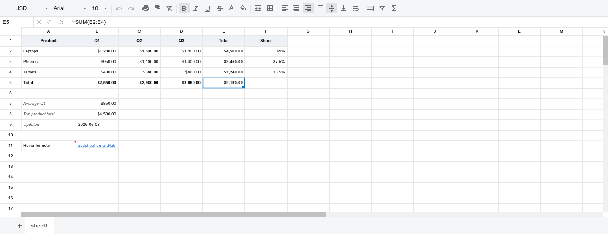

# Zedsheet

A web spreadsheet written in **Rust** and compiled to **WebAssembly**. It is a
from-scratch port of [x-spreadsheet](https://github.com/myliang/x-spreadsheet):
the grid is drawn on a single `<canvas>` and the surrounding chrome (toolbar,
formula bar, sheet tabs, menus) is plain DOM, all driven from Rust via
`wasm-bindgen` / `web-sys`.



## Features

**Grid & data**
- Canvas-rendered grid with row/column headers, gridlines, and frozen panes
- Per-cell styling: background, text color, bold/italic/underline/strike,
  font family & size, horizontal & vertical alignment, text wrap
- Merged cells (merge-aware selection, navigation, and rendering)
- Cell **notes** (hover to view) and **hyperlinks** — Ctrl/Cmd-click to open;
  link cells render in blue + underline, bare hosts/emails auto-normalize
- Number / currency (¥ $ €) / percent formatting with thousands separators,
  plus custom format strings and **date / time / datetime** formats
- **Dates as serial numbers**: date/time parsing, serial arithmetic
  (`=A1+30`), and rendering per the cell's date format
- Formula engine: aggregation, logical, math/stats, and date functions
  (`SUM, AVERAGE, IF, AND, POWER, MEDIAN, ROUND, DATE, YEAR, TODAY, NOW`, …),
  cell refs and ranges (`A1`, `B2:C4`), with a circular-reference guard
- **Named ranges**: name a cell/range from the name box and use it in formulas
  (`=SUM(Revenue)`) or type the name to jump to it
- **Cross-sheet references**: `=Sheet2!A1` and `=SUM(Sheet2!A1:B3)` resolve
  against the named sheet; an unknown sheet surfaces as `#REF!`
- **Dynamic arrays & spill**: `FILTER`, `SORT`, `SORTBY`, `UNIQUE`,
  `SEQUENCE`, `RANDARRAY` — plus bare ranges (`=A1:B3`) and broadcast
  arithmetic/comparisons (`=A1:A9*2`, `FILTER(A1:A9, B1:B9>5)`) — spill
  into neighboring cells, outlined in blue; an obstructed spill shows
  `#SPILL!` at the anchor, an empty result `#CALC!`, and references into
  the spill range read the spilled values
- **Read-only / per-cell locking**: `setSheetReadOnly("sheet1", true)` blocks
  every write to that sheet (editor, paste, clear, insert/delete row/col);
  the per-cell `editable` flag (toggled via the **Cell Editable** context
  menu item) locks individual cells. Toggling on either side is
  immediately visible to the other (the registry and the renderer's copy
  share state)
- **Text rotation, shrink-to-fit & indent**: the context menu's **Rotate
  0°/45°/90°/-45°**, **Shrink to fit**, and **Increase/Decrease indent**
  items style the active cell's text. Rotation pivots around the cell
  center; shrink-to-fit scales the font down to fit; indent adds to the
  left padding (ignored for right/center alignment, matching Excel)
- **Non-contiguous (Ctrl/Cmd+click) multi-range selection**: Ctrl/Cmd-click
  adds a disjoint range; Ctrl/Cmd-drag extends the most-recently-added range.
  Style / border / clear / paste operations apply to every selected range.
  A plain click clears all Ctrl-added ranges and starts a new single-rect
  selection; the formula bar / name box / toggle-reads always reflect the
  *active cell* (anchor of the last range), matching Excel.
- **Data validation** (right-click → Data Validation…): constrain cell input
  to a `list` (with dropdown arrow + click-to-pick popover), `number`
  (between / not between / equal / not equal / less than / greater than),
  `text-length`, `email`, or `phone` rule, optionally `Treat empty as
  invalid`. Invalid commits keep the cell editor open with a red border
  and an inline error label; invalid formula-bar commits surface a brief
  toast and revert the cell. Rules are saved per cell and round-trip
  through the workbook JSON.
- Formula references auto-adjust when rows/columns are inserted or deleted

**Interaction**
- Click to select, drag to range-select (works in every direction), keyboard
  navigation, mouse-wheel scroll
- In-cell editor (double-click or Enter); commit on Enter/Tab, cancel on Esc
- **Fill handle**: drag the selection's bottom-right handle to copy values &
  formats, extend a numeric series (1, 2 → 3, 4…), or fill formulas with
  relative references adjusted
- Row/column resize by dragging header borders; draggable scrollbar thumbs
- Clipboard: copy / cut / paste, plus `Ctrl/Cmd + C/X/V`, `Ctrl/Cmd + B/I/U`,
  and `Delete` to clear

**Chrome**
- Icon toolbar (sprite-based) with live active-state that reflects the
  selected cell — format / font / font-size dropdowns, text & fill color
  pickers, bold/italic/underline/strike, merge, align, wrap, freeze
- Excel-style **formula bar**: name box (navigate to a cell or `A1:B3` range,
  or define/jump to a named range), cancel/confirm, an `fx` function picker,
  and a formula input bound to the active cell
- Right-click **context menu**: copy/cut/paste, insert/delete row & column,
  notes, hyperlinks, clear contents
- **Multi-sheet** tabs: add, switch, double-click to rename, right-click to delete

## Prerequisites

- A recent stable [Rust toolchain](https://rustup.rs/)
- The WebAssembly target:
  ```sh
  rustup target add wasm32-unknown-unknown
  ```
- [Trunk](https://trunkrs.dev/):
  ```sh
  cargo install trunk
  ```

## Running

Serve with live reload:

```sh
trunk serve
```

Or build the static bundle into `dist/` and serve it with any static server:

```sh
trunk build            # production: trunk build --release
cd dist && python3 -m http.server 8099
```

Then open the printed URL. The app mounts into the `#zedsheet` element in
[`index.html`](./index.html).

### Using it in your own app (React, etc.)

```sh
npm install zedsheet
```

The package is self-contained — ESM glue + `.wasm` + TypeScript types + a
stylesheet with the toolbar icon sprite inlined. No assets to copy. (To build
it from source instead: `node scripts/build-npm.mjs`, then
`npm install /path/to/zedsheet/pkg`.)

#### React example

`ZedSheet.tsx` — loads the wasm once, mounts a spreadsheet into a sized
`<div>`, and reports edits through an `onChange` prop (same component as
[`examples/react/ZedSheet.tsx`](./examples/react/ZedSheet.tsx)):

```tsx
import { useEffect, useRef } from "react";

// Load + instantiate the .wasm once for the whole app.
let ready: Promise<typeof import("zedsheet")> | null = null;
function load() {
  if (!ready) {
    ready = import("zedsheet").then(async (mod) => {
      await mod.default(); // init(): fetches and instantiates the .wasm
      return mod;
    });
  }
  return ready;
}

type Props = {
  /** Container id — `#${id}` is also the selector the JS data API targets.
   *  Give each instance its own id. (Avoid `zedsheet`: that id triggers the
   *  standalone demo's auto-mount.) */
  id?: string;
  /** Seed workbook: zedsheet JSON (string, object, or array). Omit for blank. */
  data?: unknown;
  /** Called with the serialized workbook after every edit. */
  onChange?: (json: string) => void;
};

/** Interactive spreadsheet that fills its container (which must have a size). */
export default function ZedSheet({ id = "zedsheet-root", data, onChange }: Props) {
  const ref = useRef<HTMLDivElement>(null);

  useEffect(() => {
    let cancelled = false;
    load().then((mod) => {
      if (cancelled || !ref.current) return;
      const seed =
        typeof data === "string" ? data : data ? JSON.stringify(data) : undefined;
      mod.mount(`#${id}`, seed);
      if (onChange) mod.on_change(`#${id}`, onChange);
    });
    return () => {
      cancelled = true;
    };
    // Mount once — the sheet owns its state from here on.
    // eslint-disable-next-line react-hooks/exhaustive-deps
  }, [id]);

  return <div id={id} ref={ref} style={{ width: "100%", height: "100%" }} />;
}
```

`App.tsx`:

```tsx
import "zedsheet/zedsheet.css"; // grid + toolbar styles (icons inlined)
import ZedSheet from "./ZedSheet";

export default function App() {
  return (
    <div style={{ height: "100vh", width: "100vw" }}>
      <ZedSheet onChange={(json) => localStorage.setItem("workbook", json)} />
    </div>
  );
}
```

Drive the mounted sheet from anywhere via the JS API (every function takes the
container's CSS selector):

```ts
import {
  get_data, load_data,        // workbook JSON: snapshot / restore
  export_csv, import_csv,     // active sheet ⇄ CSV text
  export_xlsx, import_xlsx,   // whole workbook ⇄ .xlsx bytes
  setSheetReadOnly,           // lock / unlock a sheet by name
} from "zedsheet";

const json = get_data("#zedsheet-root");      // serialize every sheet
if (json) load_data("#zedsheet-root", json);  // replace the workbook
setSheetReadOnly("sheet1", true);             // block all edits to that sheet

// Download the workbook as .xlsx
const bytes = export_xlsx("#zedsheet-root");
if (bytes) {
  const a = document.createElement("a");
  a.href = URL.createObjectURL(new Blob([bytes]));
  a.download = "workbook.xlsx";
  a.click();
}
```

**Next.js**: render it client-side only —
`dynamic(() => import("./ZedSheet"), { ssr: false })`. Bundler notes live in
**[docs/REACT.md](./docs/REACT.md)**.

> **Tip:** when verifying behavior, prefer building once and serving the static
> `dist/` over `trunk serve` — Trunk's auto-reload re-initializes the WASM
> module and can re-run the mount during a session.

## Project layout

```
src/
├── lib.rs              # wasm-bindgen entry point + sample data
├── zedsheet.rs         # ZedSheet: builds the DOM shell and wires all events
├── config.rs           # CSS prefix and constants
├── index.css           # ported x-spreadsheet styles
├── core/               # data model
│   ├── data_proxy.rs   # single source of truth (cells, styles, merges,
│   │                   #   freeze, selection, formula evaluation)
│   ├── cell.rs, row.rs, col.rs, cols.rs, cell_range.rs, merges.rs
│   ├── format.rs       # number/currency/percent formatting (unit-tested)
│   ├── state.rs, validation.rs, auto_filter.rs, helper.rs
├── formula/            # tokenizer + functions (evaluator lives in data_proxy)
├── renderer/           # canvas drawing
│   ├── table_renderer.rs  # state, hit-testing, selection, mutations
│   ├── render.rs          # body / headers / selection / scrollbar drawing
│   ├── viewport.rs, area.rs, range.rs, canvas.rs, border.rs,
│   ├── cell_render.rs, alphabets.rs
└── component/          # DOM components (toolbar, element helpers, options, …)
```

The renderer consumes `core::data_proxy::DataProxy` directly; the DOM chrome in
`zedsheet.rs` holds the renderer in an `Rc<RefCell<…>>` and re-renders the
canvas after each interaction.

## Development

```sh
# Compile to wasm (fast feedback)
cargo build --target wasm32-unknown-unknown

# Run unit tests (native)
cargo test

# Build the publishable npm package into pkg/ (wasm-pack + CSS + manifest)
node scripts/build-npm.mjs

# Publish (maintainers)
cd pkg && npm publish
```

## Status & known limitations

Most of x-spreadsheet's interactive surface is implemented. Unit tests are
ported for `alphabet`, `cell_range`, `format`, the formula evaluator, and
`helper` (`cargo test`). Not yet done:

- `#REF!` for references to deleted cells (currently left stale)
- Absolute references (`$A$1`) and deeper nested-function arg parsing
- Data validation / autofilter UI, print, and locale/i18n

## Credits

Port of [x-spreadsheet](https://github.com/myliang/x-spreadsheet) by myliang
(MIT). Icon sprite assets originate from that project.
